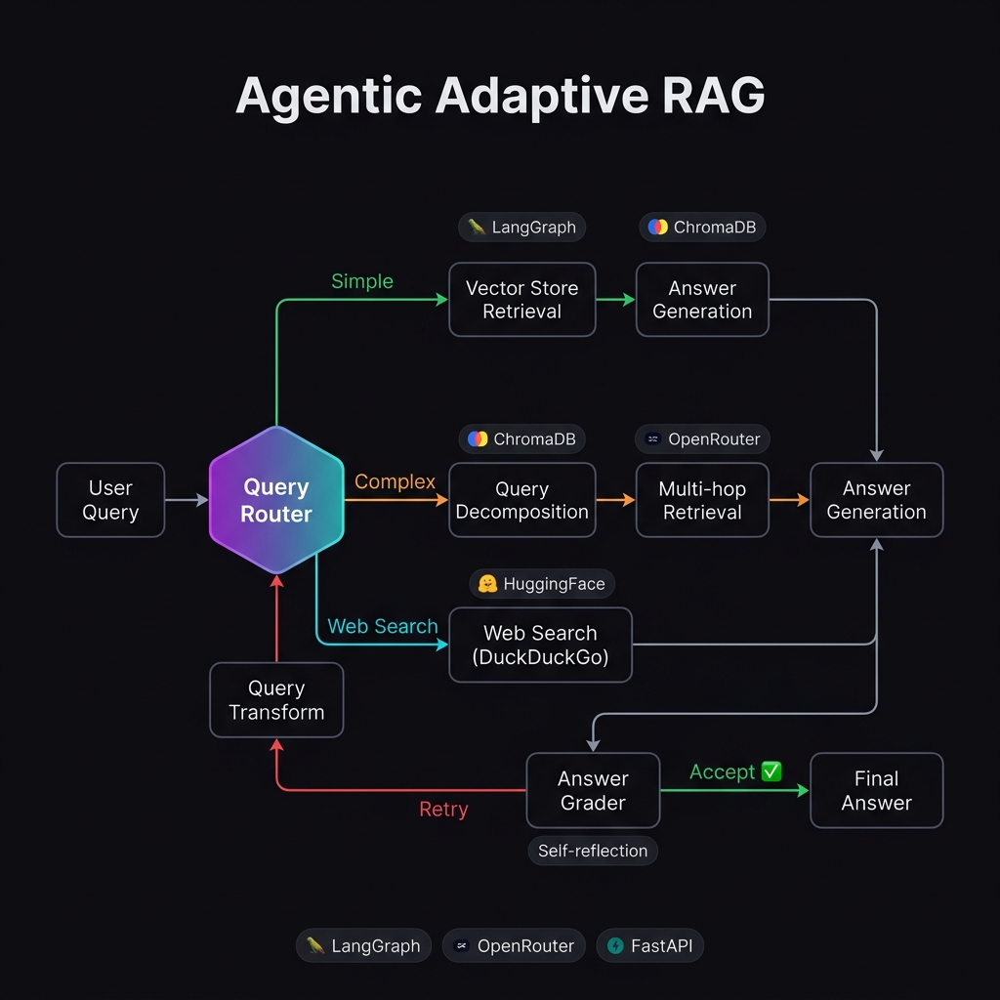
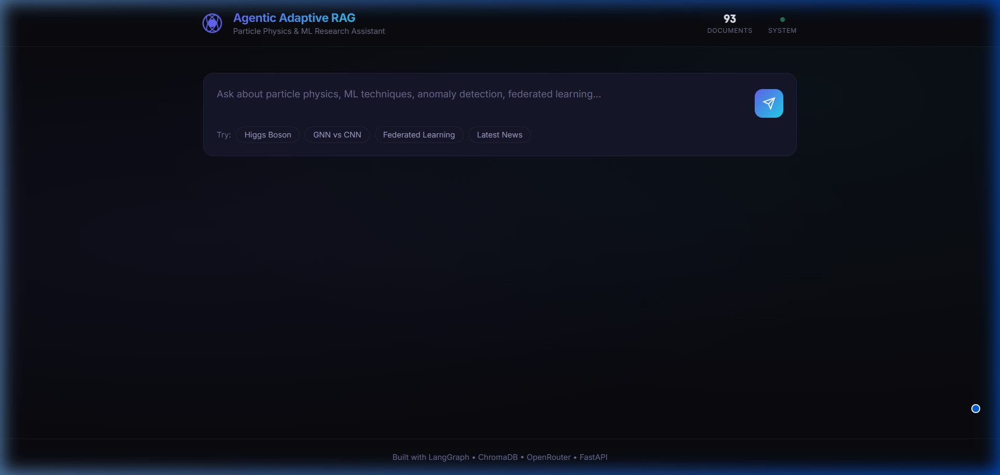

<p align="center">
  
</p>

<h1 align="center">🔬 Agentic Adaptive RAG</h1>

<p align="center">
  <strong>An intelligent Retrieval-Augmented Generation system with adaptive retrieval strategies, self-correction, and multi-hop reasoning for particle physics & ML research.</strong>
</p>

<p align="center">
  
  
  
  
  
  
</p>

---

## 🎯 Overview

Traditional RAG systems use a **one-size-fits-all** retrieval strategy — every query gets the same treatment. This project implements an **agentic, adaptive** approach where an LLM-powered agent dynamically selects the optimal retrieval strategy based on query complexity, self-grades its answers for hallucination, and retries with reformulated queries when needed.

### Key Features

| Feature | Description |
|---------|-------------|
| **🔀 Adaptive Routing** | LLM-based query classifier routes to simple retrieval, multi-hop decomposition, or web search |
| **🧩 Query Decomposition** | Complex queries are automatically broken into sub-questions for multi-hop retrieval |
| **🔎 Self-Grading** | Generated answers are graded for factual grounding and relevance with automatic retry |
| **🔄 Self-Correction** | Ungrounded answers trigger query transformation and re-retrieval (up to N retries) |
| **🌐 Web Search Fallback** | Queries about recent events or out-of-scope topics fall back to live web search |
| **📚 arXiv Knowledge Base** | Automatically ingests particle physics & ML papers from arXiv |
| **🖥️ Web UI** | Clean, modern interface with agent path visualization |

---

## 🏗️ Architecture

The system is built as a **LangGraph state machine** with conditional routing:

```
User Query
    │
    ▼
┌──────────────────┐
│   Query Router    │ ← LLM classifies query complexity
│   (LLM-based)     │
└──────┬───────────┘
       │
  ┌────┼──────────────────┐
  ▼    ▼                  ▼
Simple   Complex       Web Search
  │        │                │
  ▼        ▼                ▼
Single   Decompose →     DuckDuckGo
Retrieval  Multi-hop       Search
  │      Retrieval          │
  └────┬────┘───────────────┘
       ▼
┌──────────────────┐
│ Answer Generator  │ ← Context-grounded generation
└──────┬───────────┘
       ▼
┌──────────────────┐
│  Answer Grader    │ ← Hallucination detection
└──────┬───────────┘
       │
  ┌────┼────┐
  ▼         ▼
Accept    Retry
  │      (transform query)
  ▼         │
 END    ────┘ → back to Router
```

### Agent Strategies

| Strategy | Trigger | Pipeline |
|----------|---------|----------|
| **Simple** | Straightforward factual queries | Route → Retrieve (top-K) → Generate → Grade |
| **Complex** | Multi-faceted analytical queries | Route → Decompose → Multi-hop Retrieve → Generate → Grade |
| **Web Search** | Recent events / out-of-scope | Route → Web Search → Generate → Grade |
| **Self-Correction** | Answer fails grading | Transform Query → Re-route → Re-retrieve → Re-generate |

---

## 📊 Evaluation Results

Evaluated on 5 curated queries designed to trigger different strategies:

### Aggregate Metrics

| Metric | Value |
|--------|-------|
| **Grounding Rate** | **100%** |
| **Avg Relevance Score** | **0.82** |
| **Routing Accuracy** | **60%** |
| **Avg Processing Time** | **20.88s** |
| **Avg Steps per Query** | **4.8** |
| **Success Rate** | **100%** (5/5) |

### Per-Query Results

| # | Query | Strategy | Grounded | Relevance | Time |
|---|-------|----------|----------|-----------|------|
| 1 | Higgs boson discovery at CERN | `complex` | ✅ | 1.00 | 23.6s |
| 2 | GNNs vs CNNs for jet classification | `complex` | ✅ | 0.80 | 26.2s |
| 3 | Federated learning in particle physics | `complex` | ✅ | 0.80 | 19.5s |
| 4 | Anomaly detection at LHC | `complex` | ✅ | 0.70 | 25.2s |
| 5 | Latest quantum computing at CERN 2025 | `web_search` | ✅ | 0.80 | 9.9s |

### Key Observations

- **100% grounding rate** — the agent never hallucinated; when context was insufficient, it explicitly acknowledged limitations rather than fabricating answers
- **Intelligent routing** — Query 5 (about 2025 developments) was correctly routed to web search since this information wouldn't exist in pre-downloaded arXiv papers
- **Honest uncertainty** — The agent cited specific papers (e.g., "Hallaji et al. (2022)") and flagged when context didn't fully answer the question
- **Query decomposition worked well** — Complex queries were split into 3-4 focused sub-questions for targeted retrieval

---

## 🛠️ Tech Stack

| Layer | Technology | Purpose |
|-------|-----------|---------|
| **Agent Framework** | [LangGraph](https://github.com/langchain-ai/langgraph) | State machine orchestration with conditional routing |
| **LLM** | [DeepSeek V3](https://deepseek.com/) via [OpenRouter](https://openrouter.ai/) | Query classification, generation, grading |
| **Embeddings** | [all-MiniLM-L6-v2](https://huggingface.co/sentence-transformers/all-MiniLM-L6-v2) | Local semantic embeddings (HuggingFace) |
| **Vector Store** | [ChromaDB](https://www.trychroma.com/) | Persistent document storage & similarity search |
| **Web Search** | [DuckDuckGo](https://duckduckgo.com/) | Fallback search for recent/out-of-scope queries |
| **Backend** | [FastAPI](https://fastapi.tiangolo.com/) | REST API with auto-generated docs |
| **Frontend** | Vanilla HTML/CSS/JS | Dark-themed UI with agent path visualization |
| **Containerization** | [Docker](https://www.docker.com/) | One-command deployment |

---

## 🚀 Quick Start

### Prerequisites

- Python 3.11+
- [OpenRouter API key](https://openrouter.ai/) (or any OpenAI-compatible API)

### 1. Clone & Setup

```bash
git clone https://github.com/YOUR_USERNAME/agentic-adaptive-rag.git
cd agentic-adaptive-rag

python -m venv venv
source venv/bin/activate  # Windows: .\venv\Scripts\activate

pip install -r requirements.txt
```

### 2. Configure

```bash
cp .env.example .env
# Edit .env and add your OpenRouter API key
```

### 3. Ingest Knowledge Base

```bash
python -c "from src.ingestion.ingest import run_ingestion; run_ingestion()"
```

This downloads ~25 arXiv papers on particle physics & ML and stores them in ChromaDB.

### 4. Run Demo (with metrics)

```bash
python run_demo.py
```

Results are saved to `results/demo_results.json` and `results/evaluation_results.md`.

### 5. Start Web UI

```bash
uvicorn src.api.app:app --reload --port 8000
# Open http://localhost:8000
```

### 6. Docker (Alternative)

```bash
docker compose up --build
# Open http://localhost:8000
```

---

## 📁 Project Structure

```
agentic-adaptive-rag/
├── src/
│   ├── agent/
│   │   ├── graph.py        # LangGraph workflow with conditional routing
│   │   ├── nodes.py        # Agent node functions (classify, retrieve, generate, grade)
│   │   ├── prompts.py      # All LLM prompt templates
│   │   └── state.py        # Agent state schema
│   ├── retrieval/
│   │   ├── vector_store.py # ChromaDB manager with HuggingFace embeddings
│   │   └── web_search.py   # DuckDuckGo search fallback
│   ├── ingestion/
│   │   ├── arxiv_loader.py # arXiv paper downloader
│   │   ├── chunker.py      # Recursive text chunking
│   │   └── ingest.py       # Ingestion pipeline orchestrator
│   ├── api/
│   │   └── app.py          # FastAPI REST endpoints
│   └── config.py           # Centralized configuration
├── frontend/
│   ├── index.html          # Web UI
│   ├── style.css           # Dark theme design system
│   └── script.js           # Frontend logic
├── results/
│   ├── demo_results.json   # Full evaluation results
│   └── evaluation_results.md
├── data/                   # ChromaDB persistent storage
├── assets/                 # README images
├── run_demo.py             # Demo runner & metrics generator
├── Dockerfile
├── docker-compose.yml
├── requirements.txt
├── .env.example
└── README.md
```

---

## 🔌 API Endpoints

| Method | Endpoint | Description |
|--------|----------|-------------|
| `POST` | `/api/query` | Submit a query through the adaptive RAG pipeline |
| `POST` | `/api/ingest` | Trigger document ingestion from arXiv |
| `GET` | `/api/stats` | Get vector store statistics |
| `GET` | `/api/health` | Health check |
| `GET` | `/` | Serve web frontend |

### Web UI

<p align="center">
  
</p>

### Example Request

```bash
curl -X POST http://localhost:8000/api/query \
  -H "Content-Type: application/json" \
  -d '{"query": "How are GNNs used in particle physics?"}'
```

### Example Response

```json
{
  "query": "How are GNNs used in particle physics?",
  "answer": "Graph Neural Networks (GNNs) have been applied...",
  "query_type": "simple",
  "is_grounded": true,
  "relevance_score": 0.85,
  "steps_taken": [
    "[Router] Classified as 'simple': ...",
    "[Retrieval] Retrieved 5 documents...",
    "[Generation] Generated answer (842 chars)",
    "[Grader] Grounded: True, Relevance: 0.85"
  ],
  "processing_time_seconds": 8.42
}
```

---

## 🔮 Future Improvements

- [ ] Add PDF ingestion for full paper text (not just abstracts)
- [ ] Implement conversation memory for multi-turn Q&A
- [ ] Add re-ranking with cross-encoder models
- [ ] Support parallel retrieval for sub-queries
- [ ] Add streaming responses via WebSocket
- [ ] Implement user feedback loop for answer quality tracking

---

## 📄 License

MIT License — see [LICENSE](LICENSE) for details.

---

<p align="center">
  Built with ❤️ for advancing scientific research through intelligent AI systems
</p>
